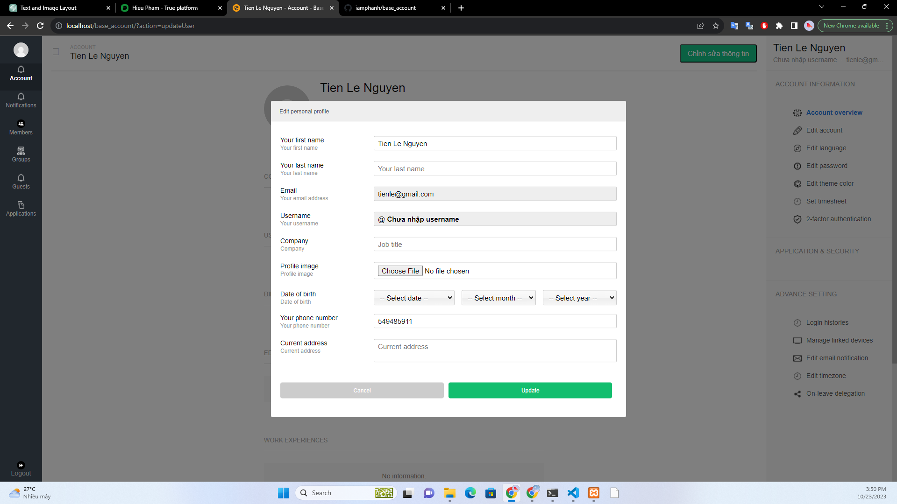

# Base Account

- The application ensures that all basic functions of the request are fulfilled. 
- I not use any external library.
- Use MySQL for the database.
- The project was created using the MVC model.
- Use PHP for backend development, without any Framework.

## Main features

### Account signup

The app must allow users to register for a new account. \
To prevent revealing user information, encrypt user passwords.

### Account login
The app must allow users to login with their email and password. \
When attempting to log in, report any errors or login information errors.\
To prevent revealing user information, encrypt user passwords.
### Account profile
On successful login, the app should show a simple screen with user’s information (simply all above user information). There is one button to EDIT the user’s info explicitly. Only company name, name and job_title could be edited.

#### Update profile avatar

The app should allow the user to change his/her avatar.  I can make it simply in a standard form (Only images located in the "base_account/images/" folder can be used to change avatar images.
)

### Account logout
There is also a button for logout, for which the user can securely logout. \
When registering fails or specific registration details are missing, report an error.\
To prevent CSRF, sign out.

## Design

### Login page

### Signup page 

### Account profile

### Edit popup

### Database
Database schema stored in databases.db file.

### Install a computer.

Inside XAMPP, start the Apache service. By doing this, you'll be able to build and test web applications on your computer using a virtual web server.

